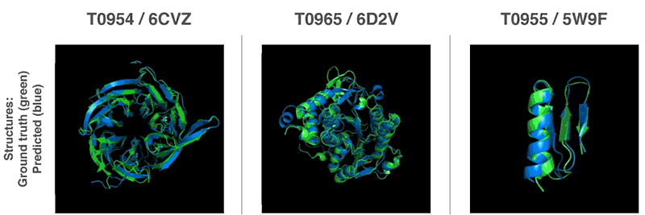

layout: true
background-image: url("general-slide2.jpg")
background-size: cover

---

# Biological Sequences

---

# RNA Editing

.center[]

???

Adenosine to Inosine editing. 

---
class: top
## ALU Transposons

A **Transposon** or **Transposable Element** is a DNA sequence which can change its position in the genome of a cell.

.footnote[Source:http://2014.igem.org/Team:Evry/Biology/Transposons]

???

-Also called 'jumping genes', Transposons are of interest in Genetics as they can cause mutations, cancers and changes to the genome size.

- Discovered in 
-Transposons can use a 'copy and paste' or 'cut and paste' method for transposition. 

-ALU transposons account for about 15%-17% of the human genome. 
---

# Data Description

- The data are obtained from [REDIportal](http://srv00.recas.ba.infn.it/atlas/). A database of 4.5 million A-to-I RNA editing events in 55 bodysites from 150 healthy human individuals. 

- Composed of RNA sequences of length 301 centered at an adenine. 

- There are three classes based on where the editing region is located:
  1. ALU repeat region     (n=50,000)
  2. Non-ALU repeat region (n=50,000)
  3. Non-repetitive region (n=50,000)
  
???
A-to-I is Adenine to Inosine(adapter molecule)

---

# Why CNNs?

<b>Fasta File</b>

???

- CNNs predict especially well when spatial correlation exists, such as in genetic sequence data. 
- In problems with 'neat' and small data we usually use conventional methods. 
- messy data includes: rotations to the image, rescaling, and distortion. 
---
class: left

# pysster: a Sequence-STructure classifiER

.pull-left[]
.pull-right[]

???

- 3 convolution and pooling layers (ReLU function)
- 2 dense layers (we only care about the last layer for weights)
- Use a soft max for the three class, classification
---

# Validation Loss

.center[]

---
# Model Summary

.center[]

???
- One vs. all classifiction to predict ROC
- Precision = $TP/(TP+FP)$
- Recall = $TP/(TP+FN)$
- F1 = $\frac{2*recall*precision}{Recall+precision}$, penalizes extreme values caused by
---
# What else can this package do?

1. Recurrent Neural Networks (RNNs) and Long short-term memory (LSTM)

2. Visual expression for DNA and protein motifs:

---

# Other areas using Deep Learning in Bioinformatics

AlphaFold by Google's DeepMind team: 

.footnote[https://deepmind.com/blog/alphafold/]
---

# Questions?

**References:**

- "pysster: classification of biological sequences by learning sequence and structure motifs with convolutional neural networks."
Budach, Marsico.

